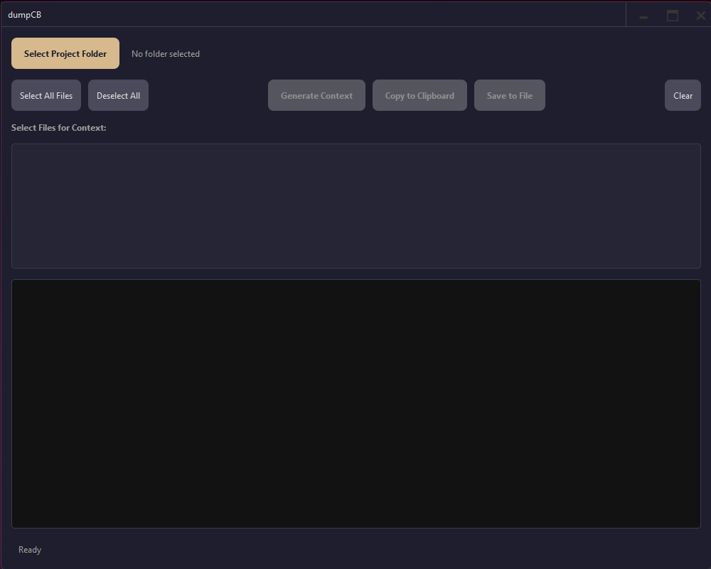

# dumpCB - Context Builder Assistant


[](https://opensource.org/licenses/MIT) <!-- Example license badge -->

Streamline your workflow by effortlessly gathering relevant code context for Large Language Models (LLMs) or other analysis tasks. `dumpCB` scans your project, intelligently filters files using `.gitignore` rules, and generates a clean, formatted context package, ready for use.

---

## Key Features

*   **Project Scanning:** Quickly scans a selected project folder.
*   **Intelligent Filtering:** Uses `.gitignore`, `.llmignore`, and default patterns to exclude irrelevant files.
*   **Binary File Detection:** Automatically skips common binary file types.
*   **Selective Context Generation:** Allows users to select specific files to include in the final context.
*   **Formatted Output:** Generates a clean, Markdown-formatted output including project structure and file contents.
*   **Modern UI:** Built with PySide6 for a responsive user experience.
*   **Customizable:** respects `.llmignore` for project-specific exclusion rules.
*   **Cross-Platform Potential:** Built with Python and Qt (though packaging currently focuses on Windows).

## Screenshots



```

---

## Installation & Setup (Development)

To run or develop `dumpCB` locally, follow these steps:

1.  **Prerequisites:**
    *   Python 3.8+ (Recommended)
    *   `pip` (Python package installer)
    *   `git` (for cloning)

2.  **Clone the Repository:**
    ```bash
    git clone https://github.com/tychius/dumpCB.git # Replace with your repo URL later
    cd dumpCB
    ```

3.  **Create and Activate a Virtual Environment:**
    *   **Windows:**
        ```bash
        python -m venv venv
        .\venv\Scripts\activate
        ```
    *   **macOS/Linux:**
        ```bash
        python3 -m venv venv
        source venv/bin/activate
        ```

4.  **Install Dependencies:**
    ```bash
    pip install -r requirements.txt
    ```

---

## Running the Application

Once the setup is complete, you can run the application directly from the source code:

```bash
python run_app.py
```

---

## Building the Executable (Windows)

To create a standalone `.exe` file for Windows:

1.  Ensure you have completed the Installation & Setup steps above.
2.  Install PyInstaller within your virtual environment:
    ```bash
    pip install pyinstaller
    ```
3.  Run the PyInstaller build command from the project root directory:
    ```bash
    python -m PyInstaller --onefile --windowed --icon=assets/logo.ico --add-data "app/ui/style.qss;app/ui" --add-data "assets;assets" run_app.py --name dumpCB
    ```
4.  The executable `dumpCB.exe` will be located in the `dist/` folder.

---

## License

This project is licensed under the MIT License - see the [LICENSE](LICENSE) file for details.

---

## Contributing

Contributions are welcome! Please feel free to submit a pull request or open an issue.

## Acknowledgements

*   Built with the amazing [PySide6](https://www.qt.io/qt-for-python) library.
*   Uses [pathspec](https://pypi.org/project/pathspec/) for `.gitignore` style pattern matching.
