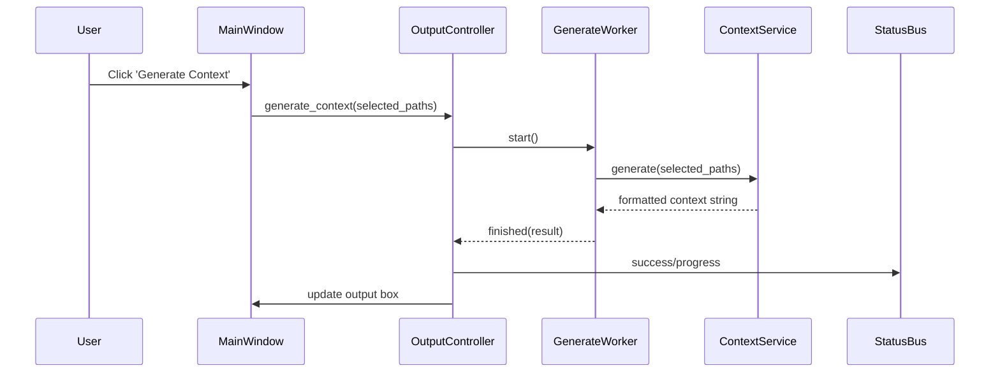

# Architecture

## Layer Diagram

```mermaid
graph LR
    subgraph UI Layer
        Widgets[UI Widgets (MainWindow, Buttons, List, Text)]
        Presenters[Presenters (WindowPresenter)]
        Controllers[Controllers (FileSelection, Output)]
    end

    subgraph Service Layer
        ContextService[ContextService]
        StatusBus[StatusBus]
        ThreadPool[Shared Thread Pool]
        MTimeCache[MTimeCache]
        IgnoreHandler[IgnoreHandler]
    end

    subgraph Background Workers
        ScanWorker[ScanWorker]
        GenerateWorker[GenerateWorker]
    end

    Users[User Interaction] --> Widgets
    Widgets -- Signals/Data --> Presenters
    Presenters -- Updates --> Widgets
    Presenters -- Uses --> Controllers
    Controllers -- Commands --> ContextService
    Controllers -- Emits --> StatusBus
    Presenters -- Listens --> StatusBus
    StatusBus -- Updates --> Presenters
    Controllers -- Creates --> Background Workers
    Background Workers -- Uses --> ContextService
    Background Workers -- Emits --> StatusBus
    Background Workers -- Results --> Controllers
    ContextService -- Uses --> IgnoreHandler
    ContextService -- Uses --> MTimeCache
    ContextService -- Uses --> ThreadPool
```

## Layer Descriptions

### Services
The service layer contains core logic for project scanning, file filtering, and context generation. `ContextService` coordinates the scan and generate operations, using helpers like `MTimeCache` for performance, `IgnoreHandler` for filtering, and a shared thread pool for concurrency. The `StatusBus` provides a signal-based messaging system for UI updates.

### Workers
Background workers (`ScanWorker`, `GenerateWorker`) run long-running tasks in separate threads, emitting signals on completion or error. They enable responsive UI by offloading heavy operations from the main thread.

### Controllers
Controllers (e.g., `FileSelectionController`, `OutputController`) mediate between the UI and services. They handle user actions, manage worker lifecycles, and update the UI via signals and the `StatusBus`.

### Widgets
Widgets are the UI components (e.g., `MainWindow`, custom panels, file lists) that present data and controls to the user. They are composed and managed by the main window and presenters.

## Sequence Diagram: Generate Context Flow

